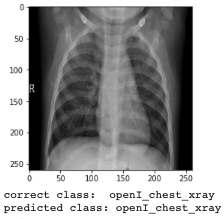

# Chest vs. Abdominal Xrays Classification (PNG)

## Goal of the Project
Goal of this project is to reproduce Chest vs. Abdominal X-Rays classification experiment, 
created by Paras Lakhani, Daniel L. Gray, Carl R. Pett, Paul Nagy & George Shih in their publication "Hello World Deep Learning in Medical Imaging" at Springer.com.

## Dataset
Very small dataset of 75 X-rays (38 Chest X-rays and 37 Abdominal X-rays) will be used in this project.
The dataset originally is coming from [OpenI](https://openi.nlm.nih.gov/), and also available for download in the 
[Github repository](https://github.com/paras42/Hello_World_Deep_Learning);

## Model
I decided to test a pre-trained model from TFHub2: EfficientNetB2.  Therefore I updated original code.  Data augmentation is included to overcome the data scarcity.
Other models on TensorFlow Hub are available at [this link](https://tfhub.dev/s?module-type=image-feature-vector&tf-version=tf2);

## Predictions
Few examples of predictions below:
  

  

  
 

## References
"Hello World Deep Learning in Medical Imaging" by Paras Lakhani, Daniel L. Gray, Carl R. Pett, Paul Nagy & George Shih [at the following link](https://link.springer.com/article/10.1007/s10278-018-0079-6);

"Hello_World_Deep_Learning" Github implementation by Paras Lakhani and X-ray dataset for download available at this [link](https://github.com/paras42/Hello_World_Deep_Learning);
